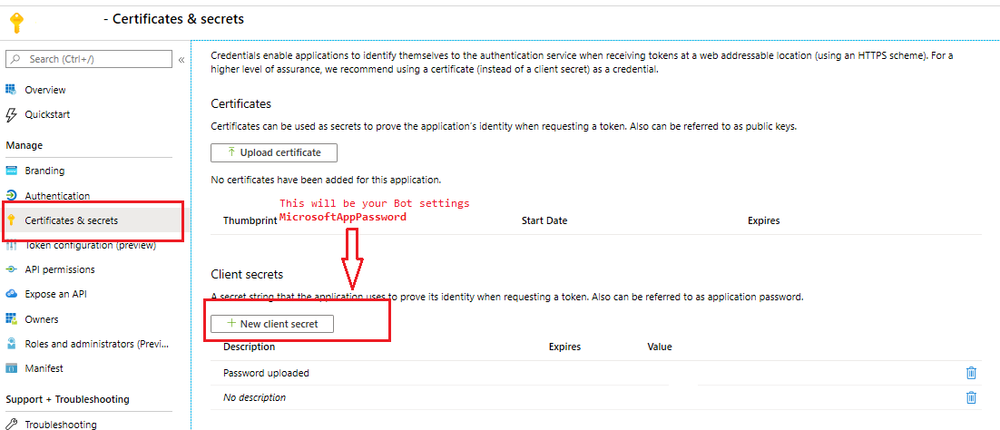
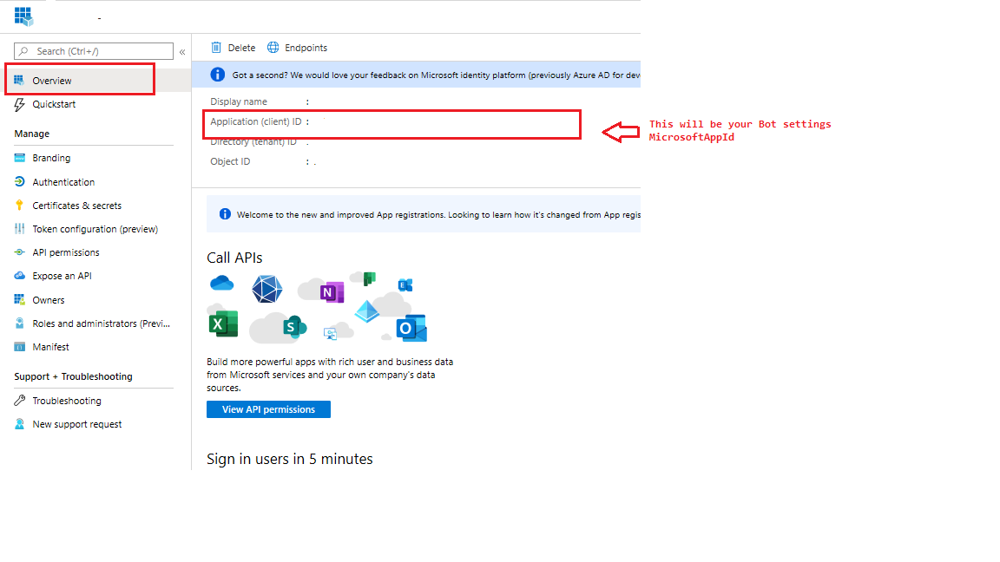
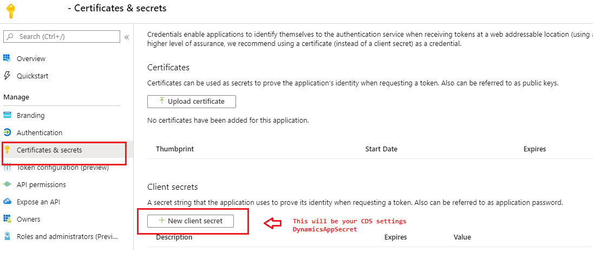

---
languages:
- csharp
products:
- dynamics-customer-service
page_type: sample
level: beginner
role: developer
description: "Sample that shows how to implement a custom smart bot for suggesting knowledge based articles and appointments in Dynamics 365 Customer Service."
---

# Build a smart assist bot

### Getting Started

This sample code contains custom smart bot implementation for suggesting knowledge base articles and appointment.

### 1. Deploying a new Smart Assist Bot

To develop a new web application based smart-assist bot, follow the steps mentioned below.

#### 1. Download the GitHub sample code

- Download the sample from the GitHub repository of [Dynamics 365 apps sample code](https://github.com/microsoft/Dynamics365-Apps-Samples).
- Unzip the downloaded file and go to directory **Dynamics365-Apps-Samples\customer-service\omnichannel\smart-assist-bot\SmartAssistBot**.
- Open the solution file **SmartBot.sln**.(https://github.com/microsoft/Dynamics365-Apps-Samples/blob/master/customer-service/omnichannel/smart-assist-bot/SmartAssistBot/CoreBot.sln) in Microsoft Visual Studio 2017 or above.

This setup broadly contains the following steps.

1. [Update the values in appsettings.json](README.md#update-appsettingsjson) <br />
2. [Publish the webapp to Azure](README.md#publish-your-webapp-to-azure)<br />
3. [Update the Messaging endpoint in Bot channels registration](README.md#update-messaging-endpoint-of-bot-channels-registration)<br />
4. [Enable Teams channel](README.md#enable-teams-channel)<br />
5. [Test your Bot online](README.md#test-your-smart-bot)<br />
6. [Smart Assist Admin Configuration](README.md#smart-assist-admin-configuration)

#### 2. Update appsettings.json

Open [Appsettings.json](SmartAssistBot/appsettings.json) through solution explorer for the solution opened in Visual Studio, and update the LUIS, Bot and CDS settings following the steps mentioned below.

1. **LUIS Settings**

 **LUIS** app settings can be left blank for this sample scenario.

        // LUIS connection settings
        "LuisAPIHostName": "westus.api.cognitive.microsoft.com",
        "LuisAPIKey": "", // LUIS APP Key
        "LuisAppId": "", // LUIS APP ID

  Follow the instructions mentioned in topic [Add natural language understanding to your bot](https://docs.microsoft.com/azure/bot-service/bot-builder-howto-v4-luis?view=azure-bot-service-4.0&tabs=csharp) to add LUIS to your bot. Once you have created a LUIS app, see [this section](https://docs.microsoft.com/azure/bot-service/bot-builder-howto-v4-luis?view=azure-bot-service-4.0&tabs=csharp#retrieve-application-information-from-the-luisai-portal) to get `LuisAppId`, `LuisAPIKey` and `LuiAPIHostName`.


  **Sample screenshots**
                                      
  

  

  
  You can create intents according to your scenario. Here we demonstrate how you can create intent for appointment.

  

  

2. **BOT Settings**

    Register your bot with Azure Bot Service and obtain the Microsoft `App ID` and a `Client secret` as illustrated below.<br />


    a. Create registration resource following the instructions mentioned in the topic [Register a bot with Azure Bot Service](https://docs.microsoft.com/azure/bot-service/bot-service-quickstart-registration?view=azure-bot-service-3.0#create-a-registration-resource).<br />


    b. Go to the resource which is just created and select settings from left pane and then click on **Manage** as shown in the screenshot below.<br />

 


    c. Generate `Client secret` as mentioned in the section [Get registration password](https://docs.microsoft.com/azure/bot-service/bot-service-quickstart-registration?view=azure-bot-service-3.0#get-registration-password) and copy it separately. This will be your _MicrosoftAppPassword_<br />



      
    d. Now click on **Overview** from left pane and copy the _Application(client) ID_. Update both the `Microsoft App ID` and `MicrosoftAppPassword` in appsettings.json.



     
    ```json
      // Bot settings
      "MicrosoftAppId": "<Microsoft App Id as copied in step 2d>",
      "MicrosoftAppPassword": "<Microsoft App password as copied in step 2c>",
      "REMOTEDEBUGGINGVERSION": "15.0.28307.222",
      "ScmType": "None"```
    ```

3. **CDS settings**

    a. Login to Azure portal with Common Data Service credentials.<br />

    b. Create an azure application to access Power Apps Common Data Service using the information provided in the section [Create an application registration](https://docs.microsoft.com/powerapps/developer/common-data-service/walkthrough-register-app-azure-active-directory#create-an-application-registration).<br />

    See the screenshots given below for reference.

  

  

    c. Copy the `Application (client) ID` and `tenant ID`.<br />

  

    d. Copy the `Client secret`<br />

  


    e. Add API permissions to this app inorder to access CDS capabilities


  

  

  


   f. Update the copied `App Id`, `tenant ID` and `client secret` to the **appsettings.json** file.<br />

        ```//Dynamics connection settings
        "DynamicsAppId": "<Azure Application Id copied in step 3c, This enables Bot to talk to CDS>",
        "DynamicsAppSecret": "<App secret for CDS App Id copied in step 3d>",
        "DynamicsOrgUrl": "<CDS Org Url>",
        "TenantId": "<CDS Tenant Id>"
        ```

  Use the same `app ID` that you created earlier using the instructions in the topic [Create a bot user](https://docs.microsoft.com/dynamics365/omnichannel/administrator/smart-assist#step-2-create-a-bot-user). Also if your bot needs to search for knowledge base articles, then you need to provide either
  the **Customer Service Manager** or **Customer Service Representative** role to your bot user.

#### 3. Publish your WebApp to Azure

- Build your code and publish from Visual Studio using the instructions mentioned in topic [Publish a Web app to Azure App Service using Visual Studio](https://docs.microsoft.com/visualstudio/deployment/quickstart-deploy-to-azure?view=vs-2019).
- Copy the WebApp's endpoint that opens in a browser after publishing. For instance, web app endpoint can be something like `https://smartassistbot2020.azurewebsites.net/`.<br />
You can also copy the endpoint from Azure Portal.<br />

Go to your web app and select **Overview** from left pane, as shown in the screenshot below.

 


#### 4. Update Messaging endpoint of Bot channels registration

- Now update the Messaging endpoint of Bot channels registration, created in 2(b) above with the WebApps messaging endpoint created in previous step
**Messaging endpoint will be ```WebApp Endpoint + /api/messages```**  (i.e)  
_In our Example, it will be : https://smartassistbot2020.azurewebsites.net/api/messages_


#### 5. Enable Teams channel

Please make sure to enable Teams channel like mentioned in this [link](https://docs.microsoft.com/azure/bot-service/channel-connect-teams?view=azure-bot-service-4.0).


#### 6. Test your Smart assist bot

- Test your bot online using ```Test in Web Chat``` option. See the section [Test the bot](https://docs.microsoft.com/azure/bot-service/abs-quickstart?view=azure-bot-service-4.0#test-the-bot) for more details. 
- Type in `omnichannelfoobar` which will set the required flag to test online.

- You can use keywords like `travel`, `book` or `audio equipment` to see the smart suggestions.

**Note**: If you are using a power virtual agent to answer customer facing queries and have added another smart assist bot for giving agent facing recommendations, type in "omnichannelfoobar" while testing your bot which will set the required flag to test online. 
<br />

 
  <br />
  
#### Custom Actions

In this sample, KB suggestion card contains two action buttons.
- Send : Copies the KBLink to conversation control
- Open : Opens up the KB article in a new browser tab

You need to update the website URL value in the variable called 'WebsiteURL' here - [KBSearchOperation.cs](SmartAssistBot/SmartAssist/Operations/KBSearchOperation.cs)

Both the actions will work by default and is handled in omnichannel side. You can also create custom action based on any scenario.

##### Steps to create a custom scenario for smart assist bot

Follow the instructions mentioned in the topic [Implement a custom scenario for smart assist bot](https://docs.microsoft.com/en-us/dynamics365/omnichannel/developer/how-to/smart-assist-scenario) to be able to get similar case recommendations for ‘printer noise’ issue in smart assist while interacting with a customer as an agent in Omnichannel for Customer Service.

#### 7. Smart Assist admin configuration

After you have built and tested the bot, follow the steps mentioned in the [Smart assist for admins](https://docs.microsoft.com/dynamics365/omnichannel/administrator/smart-assist#walk-through-to-enable-smart-assist) topic to enable Smart Assist in Omnichannel for Customer Service.
<!--
Please 

- [Create a bot user](https://docs.microsoft.com/dynamics365/omnichannel/administrator/smart-assist#step-2-create-a-bot-user).

Create a CDS application user with **User Type** as **Bot Application user**, as shown in the screenshot below.

Also you need to provide the following security roles for this bot user.

  1) Omnichannel for Customer Service Agent
  2) Customer Service Manager or Customer Service Representative

   

- [Add a smart assist bot to a workstream](https://docs.microsoft.com/dynamics365/omnichannel/administrator/smart-assist#step-3-add-a-smart-assist-bot-to-a-workstream)

 

- [Enable the productivity pane](https://docs.microsoft.com/dynamics365/omnichannel/administrator/smart-assist#step-4-enable-the-productivity-pane)

After you've enabled the productivity pane, users can see the smart-assist cards on the productivity pane in Omnichannel for Customer Service.
-->
<!--
### 2 . Integrating Smart Assist to an exisiting Azure Bot

This sample code for building a custom smart assist bot is built on top of the bot code that is generated when you create an Azure webapp bot. More information: [Create a bot with Azure Bot Service > Download code](https://docs.microsoft.com/azure/bot-service/abs-quickstart?view=azure-bot-service-4.0#download-code).

For more information about the smart assist feature and how you can build your own custom smart assist bot, see [Build a custom smart assist bot](https://docs.microsoft.com/dynamics365/omnichannel/developer/how-to/smart-assist-bot).

1. [Create a bot with Azure Bot Service](https://docs.microsoft.com/azure/bot-service/abs-quickstart?view=azure-bot-service-4.0).
2. [Download the source code](https://docs.microsoft.com/azure/bot-service/abs-quickstart?view=azure-bot-service-4.0#download-code).
3. Once your bot source code is generated, make the changes given below.
    * Copy the folder [SmartAssist](SmartAssistBot/SmartAssist) into the `<Bot name>` folder.
    * Add the required values for connecting to your Dynamics 365 organization and LUIS as shown in [appsettings.json](SmartAssistBot/appsettings.json) file.
    * Add a package reference to adaptive cards in the `.csproj` file similar to [CoreBot.csproj](SmartAssistBot/CoreBot.csproj) file.
    * Register Smart assist bot and other operations in `ConfigureServices()` in [Startup.cs](SmartAssistBot/Startup.cs) file. 
    Use `services.AddTransient<IBot, SmartAssistBot>();` to register the smart assist bot.
4.	Fill the values in [appsettings.json](SmartAssistBot/appsettings.json) file.

There are 3 primary sections in `appsettings.json` file that you will have to fill correctly for this sample code to work - 

- **Bot settings**<br />
  `MicrosoftAppId` and `MicrosoftAppPassword` are already available to you from the downloaded source code of the bot 

- **LUIS settings**<br />
  Follow the instructions mentioned in topic [Add natural language understanding to your bot](https://docs.microsoft.com/azure/bot-service/bot-builder-howto-v4-luis?view=azure-bot-service-4.0&tabs=csharp) to add LUIS to your bot.

- Once you have created a LUIS app, see the information mentioned in section [Retrieve application information from the LUIS.ai portal](https://docs.microsoft.com/azure/bot-service/bot-builder-howto-v4-luis?view=azure-bot-service-4.0&tabs=csharp#retrieve-application-information-from-the-luisai-portal) to get `LuisAppId`, `LuisAPIKey` and `LuiAPIHostName`.

- **CDS connection settings**<br />
  You will first need to create an application user in CDS using which you can interact with it. Follow the steps mentioned in the PowerApps topic [Build web applications using Server-to-Server(S2S) authentication](https://docs.microsoft.com/powerapps/developer/common-data-service/build-web-applications-server-server-s2s-authentication).
<br />
-->

<!--For information on how to register your application on Azure Active Directory, see [Walkthrough: Register an app with Azure AD](https://docs.microsoft.com/powerapps/developer/common-data-service/walkthrough-register-app-azure-active-directory).

* `DynamicsAppId` and `DynamicsAppSecret` are the application Id and client secret of the Azure Active Directory app that you have created in the previous step.

5.  Publish the code and test the bot. For more information on how to test the bot, see [Test the bot](https://docs.microsoft.com/azure/bot-service/abs-quickstart?view=azure-bot-service-4.0#test-the-bot).

    .
-->

## See also

- [Build a custom smart assist bot](https://docs.microsoft.com/dynamics365/omnichannel/developer/how-to/smart-assist-bot)
- [Implement a custom scenario for smart assist bot](smart-assist-scenario.md)
- [Create a bot with Azure Bot Service](https://docs.microsoft.com/azure/bot-service/abs-quickstart?view=azure-bot-service-4.0)
- [Build LUIS app to determine user intentions](https://docs.microsoft.com/azure/cognitive-services/luis/luis-quickstart-intents-only)
- [FullTextSearchKnowledgeArticle Action](https://docs.microsoft.com/dynamics365/customer-engagement/web-api/fulltextsearchknowledgearticle?view=dynamics-ce-odata-9)