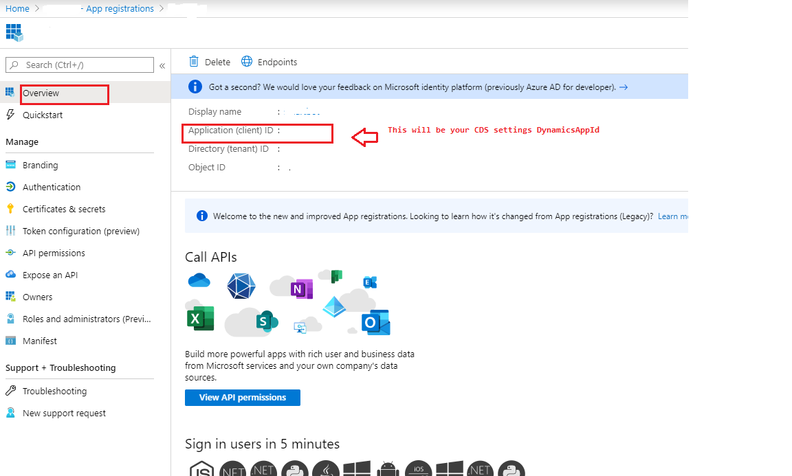
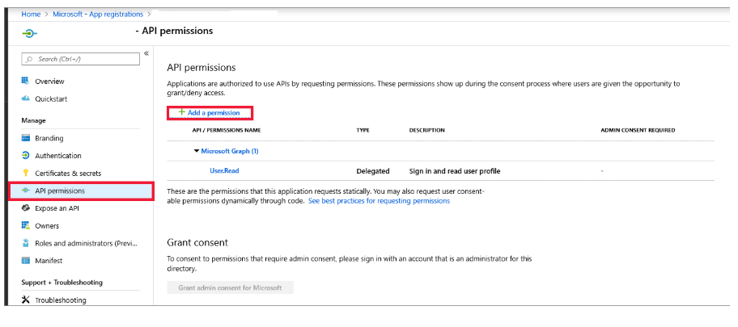
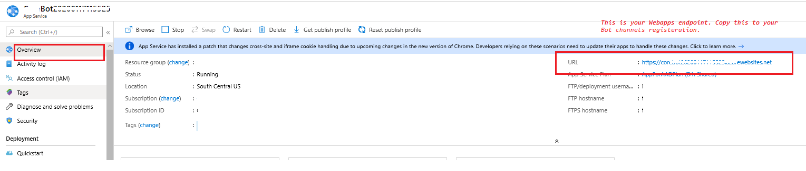
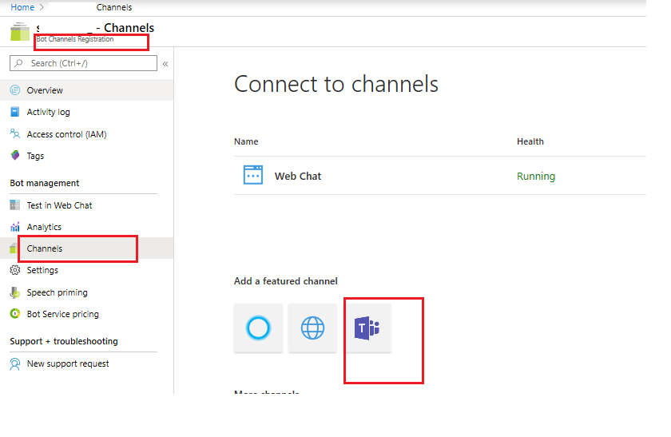
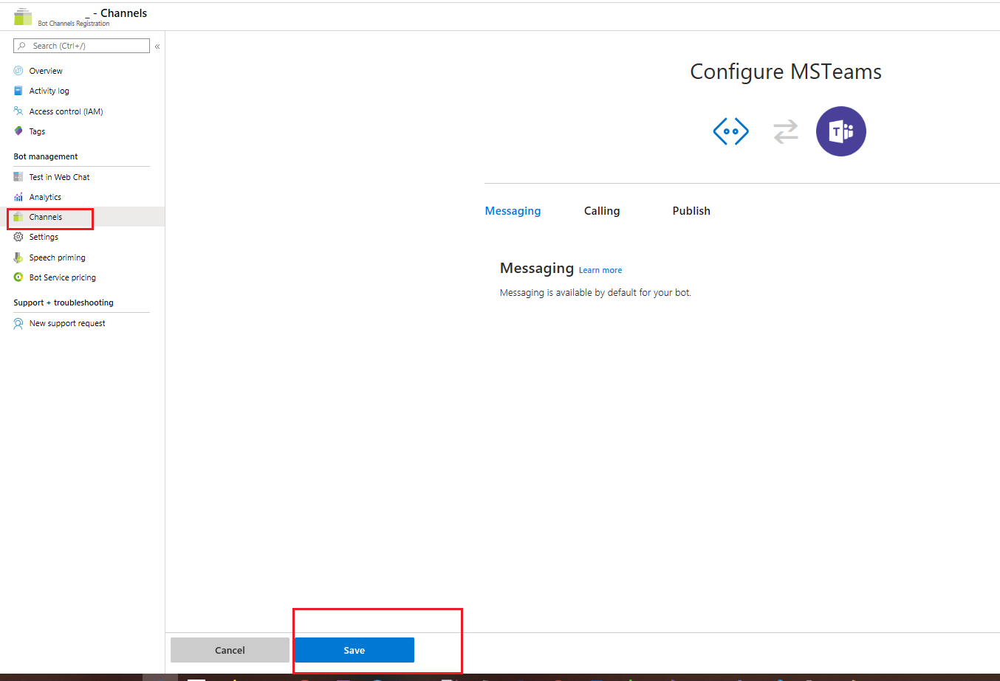

# Build a custom smart assist bot

### Getting Started
This sample code contains custom smart bot implementation for suggesting KB articles and appointment using LUIS provided by Azure Cognitive services.

### 1. Deploying a new Smart Assist Bot

To develop a new web application based smart-assist bot, follow the steps mentioned below.

- Download the github sample from [this page](https://github.com/microsoft/Dynamics365-Apps-Samples)
- Go to directory **Dynamics365-Apps-Samples\customer-service\omnichannel\smart-assist-bot\SmartAssistBot**
- Open the solution file [SmartBot.sln](https://github.com/microsoft/Dynamics365-Apps-Samples/blob/master/customer-service/omnichannel/smart-assist-bot/SmartAssistBot/CoreBot.sln) in Microsoft Visual Studio 2017 or above

This setup broadly contains the following steps.

- Update the values in appsettings.json (SmartAssistBot/appsettings.json) file<br />
- Publish the webapp to Azure<br />
- Update the Messaging endpoint in Bot channels registration<br />
- [Enable Teams channel](README.md#-Enable-Teams-channel)<br />
- Test your Bot online<br />

#### Update appsettings.json

Go to [Appsettings.json](https://github.com/microsoft/Dynamics365-Apps-Samples/blob/master/customer-service/omnichannel/smart-assist-bot/SmartAssistBot/appsettings.json) and update LUIS, Bot and CDS settings following the steps mentioned below.

1) **LUIS Settings**

    Follow the instructions mentioned in topic [Add natural language understanding to your bot](https://docs.microsoft.com/en-us/azure/bot-service/bot-builder-howto-v4-luis?view=azure-bot-service-4.0&tabs=csharp) to add LUIS to your bot. Once you have created a LUIS app, see [this section](https://docs.microsoft.com/en-us/azure/bot-service/bot-builder-howto-v4-luis?view=azure-bot-service-4.0&tabs=csharp#retrieve-application-information-from-the-luisai-portal) to get `LuisAppId`, `LuisAPIKey` and `LuiAPIHostName`


    Sample screenshots
    

    

    You can create intents according to your scenario. Here for this sample code to work please create intent for appointment.

    

    

    **LUIS** app settings can be left blank if you are interested only in KB search
    
        // LUIS connection settings
        "LuisAPIHostName": "westus.api.cognitive.microsoft.com",
        "LuisAPIKey": "", // LUIS APP Key
        "LuisAppId": "", // LUIS APP ID

2) **BOT Settings**

    Register your bot with Azure Bot Service and obtain the Microsoft App ID and a Client secret like mentioned below<br />

    a. Create registration resource following [this documentation](https://docs.microsoft.com/en-us/azure/bot-service/bot-service-quickstart-registration?view=azure-bot-service-3.0#create-a-registration-resource)<br />

    

    b. Go to the resource which is just created and select settings from left pane and then click on Manage like shown below in the screenshot.<br />

    

    c. Generate Client secret like mentioned [here](https://docs.microsoft.com/en-us/azure/bot-service/bot-service-quickstart-registration?view=azure-bot-service-3.0#get-registration-password) and copy it separately. This will be your _MicrosoftAppPassword_<br />

    

    d. Now click on **Overview** from left pane and copy the _Application(client) ID_.Update both the Microsoft App ID and secret in appsettings.json

    


    ```
    // Bot settings
    "MicrosoftAppId": "<Microsoft App Id as copied in step 2d>",
    "MicrosoftAppPassword": "<Microsoft App password as copied in step 2c>",
    "REMOTEDEBUGGINGVERSION": "15.0.28307.222",
    "ScmType": "None"```

3) **CDS settings**

    a. Login to Azure portal with CDS credentials<br />
    b. Create an azure application to access dynamics CDS following [this link](https://docs.microsoft.com/en-us/powerapps/developer/common-data-service/walkthrough-register-app-azure-active-directory#create-an-application-registration)<br />

    Screenshots for your reference

    

    

    c. Copy the Application (client) ID and client secret<br />

    

    d. Copy the client secret<br />

    

    Add API permissions to this app inorder to access CDS capabilities

    

    

    


    d. Update the copied App Id and secret to appsettings.json<br />

     ```//Dynamics connection settings
    "DynamicsAppId": "<Azure Application Id copied in step 3c, This enables Bot to talk to CDS>",
    "DynamicsAppSecret": "<App secret for CDS App Id copied in step 3d>",
    "DynamicsOrgUrl": "<CDS Org Url>",
    "TenantId": "<CDS Tenant Id>"```

  Please use the same app ID while [creating a bot user](https://docs.microsoft.com/en-us/dynamics365/omnichannel/administrator/smart-assist#step-2-create-a-bot-user) later. Also if your bot needs to search for knowledge base articles, then you need to provide either
  the **Customer Service Manager** or **Customer Service Representative** role to your bot user.

#### Publish your WebApp to azure

- Build your code and publish from visual studio like mentioned in this [link](https://docs.microsoft.com/en-us/visualstudio/deployment/quickstart-deploy-to-azure?view=vs-2019)
- Copy the WebApp's endpoint which opens up in a browser after publishing. For Instance, lets say webapp endpoint is https://smartassistbot2020.azurewebsites.net/
- Or you can also copy the endpoint from azure portal.<br />
Go to your webapp and select **Overview** from left pane (see the screenshot below).




#### Update Messaging endpoint of Bot channels registration

- Now update the Messaging endpoint of Bot channels registration, created in 2(a) with the WebApps messaging endpoint created in previous step
**Messaging endpoint will be ```WebApp Endpoint + /api/messages```**  (i.e)  
_In our Example, it will be : https://smartassistbot2020.azurewebsites.net/api/messages_


#### Enable Teams channel

Please make sure to enable Teams channel like mentioned in this [link](https://docs.microsoft.com/en-us/azure/bot-service/channel-connect-teams?view=azure-bot-service-4.0).





#### Test your Smart bot

- Test your bot online using ```Test in Web Chat``` option. See [here](https://docs.microsoft.com/en-us/azure/bot-service/abs-quickstart?view=azure-bot-service-4.0#test-the-bot) for more details. 
- If you are using trail org use keywords `travel`  or `book` or `audio equipment` to see the smart suggestions

### 2 . Integrating Smart Assist to an exisiting Azure Bot

This sample code for building a custom smart assist bot is built on top of the bot code that is generated when you create an Azure webapp bot. More information: [Create a bot with Azure Bot Service > Download code](https://docs.microsoft.com/en-us/azure/bot-service/abs-quickstart?view=azure-bot-service-4.0#download-code).

For more information about the smart assist feature and how you can build your own custom smart assist bot, see [Build a custom smart assist bot](https://docs.microsoft.com/en-us/dynamics365/omnichannel/developer/how-to/smart-assist-bot).

1. [Create a bot with Azure Bot Service](https://docs.microsoft.com/en-us/azure/bot-service/abs-quickstart?view=azure-bot-service-4.0).
2. [Download the source code](https://docs.microsoft.com/en-us/azure/bot-service/abs-quickstart?view=azure-bot-service-4.0#download-code).
3. Once your bot source code is generated, make the changes given below.
    * Copy the folder [SmartAssist](SmartAssistBot/SmartAssist) into the `<Bot name>` folder.
    * Add the required values for connecting to your Dynamics 365 organization and LUIS as shown in [appsettings.json](SmartAssistBot/appsettings.json) file.
    * Add a package reference to adaptive cards in the `.csproj` file similar to [CoreBot.csproj](SmartAssistBot/CoreBot.csproj) file.
    * Register Smart assist bot and other operations in `ConfigureServices()` in [Startup.cs](SmartAssistBot/Startup.cs) file. 
    Use `services.AddTransient<IBot, SmartAssistBot>();` to register the smart assist bot.
4.	Fill the values in [appsettings.json](SmartAssistBot/appsettings.json) file.

    There are 3 primary sections in `appsettings.json` file that you will have to fill correctly for this sample code to work - 
      - **Bot settings**<br />
        `MicrosoftAppId` and `MicrosoftAppPassword` are already available to you from the downloaded source code of the bot 
      - **LUIS settings**<br />
        Follow the instructions mentioned in topic [Add natural language understanding to your bot](https://docs.microsoft.com/en-us/azure/bot-service/bot-builder-howto-v4-luis?view=azure-bot-service-4.0&tabs=csharp) to add LUIS to your bot.
      - Once you have created a LUIS app, see [this section](https://docs.microsoft.com/en-us/azure/bot-service/bot-builder-howto-v4-luis?view=azure-bot-service-4.0&tabs=csharp#retrieve-application-information-from-the-luisai-portal) to get `LuisAppId`, `LuisAPIKey` and `LuiAPIHostName`.
      - **CDS connection settings**<br />
        You will first need to create an application user in CDS using which you can interact with it. Follow the steps mentioned in the PowerApps topic [Build web applications using Server-to-Server(S2S) authentication](https://docs.microsoft.com/en-us/powerapps/developer/common-data-service/build-web-applications-server-server-s2s-authentication).
<br /><!--For information on how to register your application on Azure Active Directory, see [Walkthrough: Register an app with Azure AD](https://docs.microsoft.com/en-us/powerapps/developer/common-data-service/walkthrough-register-app-azure-active-directory).-->
      * `DynamicsAppId` and `DynamicsAppSecret` are the application Id and client secret of the Azure Active Directory app that you have created in the previous step.

5.  Publish the code and test the bot. For more information on how to test the bot, see [Test the bot](https://docs.microsoft.com/en-us/azure/bot-service/abs-quickstart?view=azure-bot-service-4.0#test-the-bot).
.
## See also

- [Build a custom smart assist bot](https://docs.microsoft.com/en-us/dynamics365/omnichannel/developer/how-to/smart-assist-bot)
- [Create a bot with Azure Bot Service](https://docs.microsoft.com/en-us/azure/bot-service/abs-quickstart?view=azure-bot-service-4.0)
- [Build LUIS app to determine user intentions](https://docs.microsoft.com/en-us/azure/cognitive-services/luis/luis-quickstart-intents-only)
- [FullTextSearchKnowledgeArticle Action](https://docs.microsoft.com/en-us/dynamics365/customer-engagement/web-api/fulltextsearchknowledgearticle?view=dynamics-ce-odata-9)
